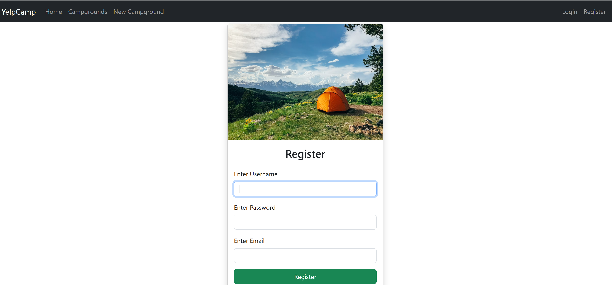
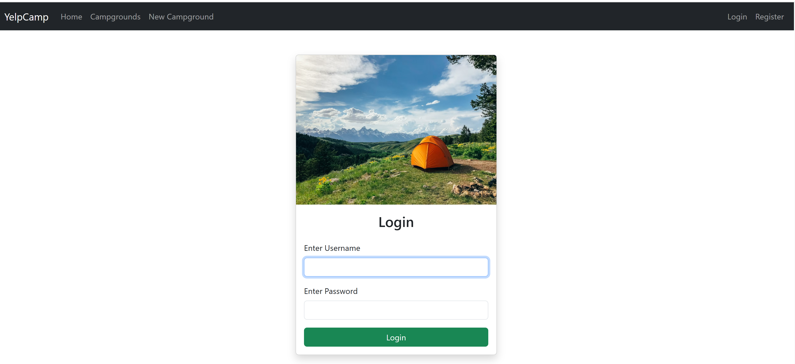
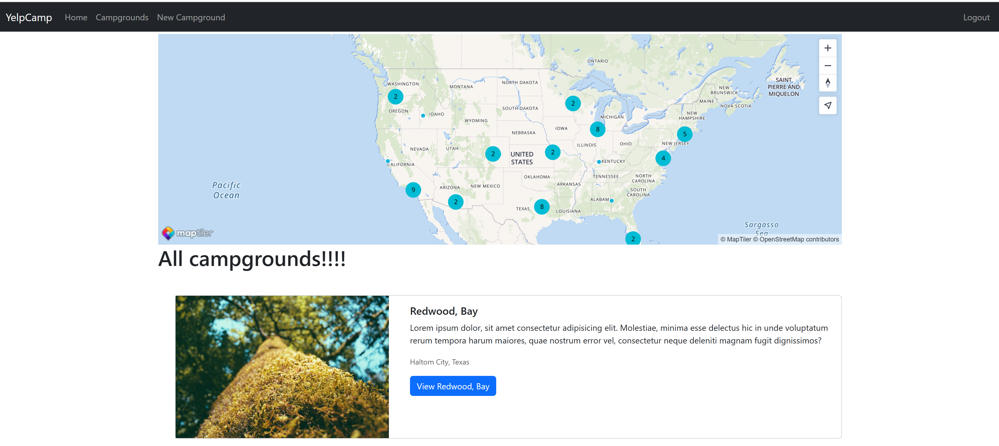
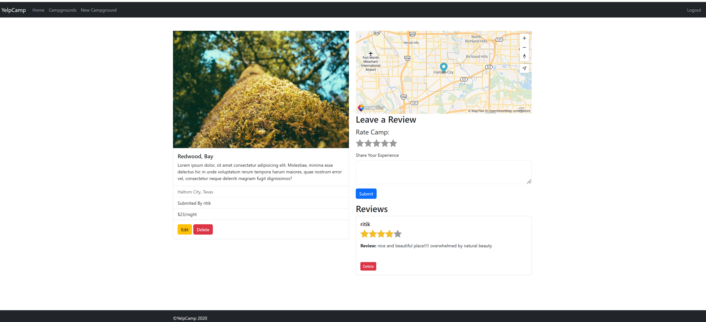
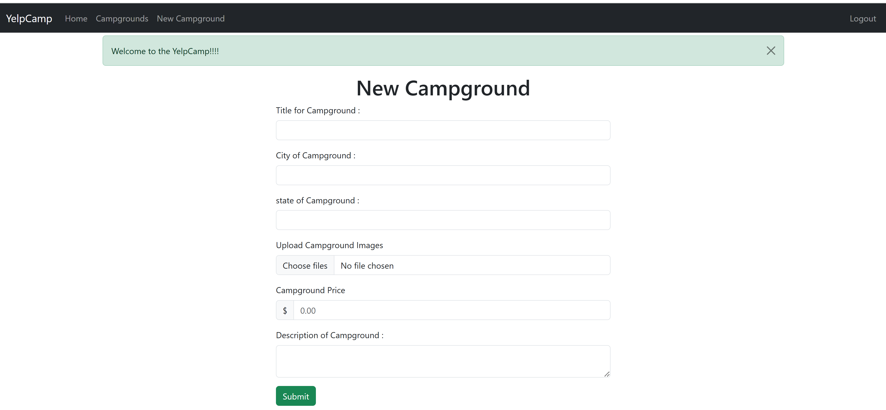
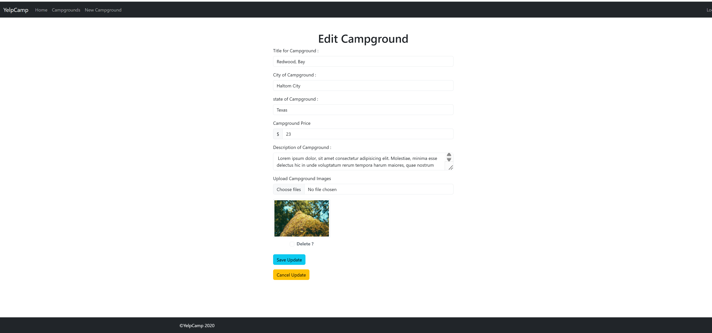

# Campground Review Platform
A full-stack web application that allows users to discover, create, and review campgrounds. The application provides secure user authentication, campground management, image uploads, interactive maps, and a review system, offering users a complete platform to share and explore camping destinations.

> Developed while learning modern full-stack web development concepts and best practices using the Node.js ecosystem.

## Live Demo
> Explore the deployed application here: https://yelp-camp-drab.vercel.app

## Features

-  User Registration & Login Authentication
-  Role-based Authorization
-  Create, Edit and Delete Campgrounds
-  Add and Manage Reviews
-  Upload Campground Images
-  Interactive Maps with MapTiler
-  Cloudinary Image Storage
-  Server-side Data Validation
-  Flash Messages & Error Handling
-  Responsive User Interface

---

## Tech Stack

### Frontend
- HTML5
- CSS3
- Bootstrap 5
- EJS

### Backend
- Node.js
- Express.js

### Database
- MongoDB
- Mongoose

### Authentication & Security
- Passport.js
- express-session
- connect-flash
- Joi Validation

### Third Party Services
- Cloudinary
- MapTiler

---

## Project Structure
```
Campground-Review-Platform
│
├── models/
├── routes/
├── controllers/
├── middleware/
├── public/
├── views/
├── utils/
├── formSchemas.js
├── app.js
└── package.json
```
---
## Installation
### Clone the repository
```bash
git clone https://github.com/Ritik722/Campground-Review-Platform.git
```

### Navigate to project folder
```bash
cd Campground-Review-Platform
```

### Install dependencies
```bash
npm install
```

### Create a `.env` file
Add the following environment variables:

```env
CLOUDINARY_CLOUD_NAME=your_cloud_name
CLOUDINARY_KEY=your_key
CLOUDINARY_SECRET=your_secret

MAPTILER_TOKEN=your_maptiler_token

DB_URL=your_mongodb_connection_string

SECRET=your_session_secret
```

### Start the application

```bash
npm start
```
Open your browser and visit

```
http://localhost:3000
```

---

## Screenshots

### Home Page


---
### Register Page



---
### Login Page



---
### All Campground



---
### Campground Details



---

### Create Campground



### Edit Campground



## What I Learned

During this project I gained practical experience with:

- RESTful Routing
- MVC Architecture
- CRUD Operations
- Authentication & Authorization
- Session Management
- MongoDB Data Modeling
- Middleware
- Error Handling
- Image Upload Workflow
- Full-Stack Web Application Development

---

## Future Improvements

- Search and Filter Campgrounds
- Favorite/Bookmark Campgrounds
- Pagination
- Dark Mode
- User Profile Dashboard
- Advanced Sorting
- Notification System

---

## Author

**Ritik Kumar**
GitHub: https://github.com/Ritik722
LinkedIn: www.linkedin.com/in/ritik-mishra-4865432a2
